# 软件工程实践第二次作业：VisionPulse 顶会热词统计平台

> 姓名：吴江彬　学号：102400329

## 作业格式描述


| 这个作业属于哪个课程 | [软件工程实践（CSDN 班级版块）](https://bbs.csdn.net/forums/2601_CS_SE_FZU)                                                                                     |
| ---------- | --------------------------------------------------------------------------------------------------------------------------------------------------- |
| 这个作业要求在哪里  | 《软件工程实践第二次作业：顶会热词统计平台》（发布前请替换为课程平台作业要求链接）                                                                                                           |
| 这个作业的目标    | 与 AI 组成人机结对，完成 CVPR/ICCV/ECCV 顶会热词统计平台的需求分析（NABCD）、原型设计、编码实现与华为云部署，并如实记录人机协作过程、代码归属与反思                                                              |
| 其他参考文献     | 《构建之法》第 3、4、8 章；[DBLP 检索 API 文档](https://dblp.org/faq/How+to+use+the+dblp+search+API.html)；[ECharts 官方文档](https://echarts.apache.org/zh/index.html) |

## 目录


* [一、项目链接、代码规范与 AI 工具](#一项目链接代码规范与-ai-工具)

* [二、PSP 表格](#二psp-表格)

* [三、NABCD 需求分析](#三nabcd-需求分析)

* [四、原型设计与原型链接](#四原型设计与原型链接)

* [五、设计实现过程](#五设计实现过程)


  * [功能结构图](#功能结构图)

  * [功能实现](#功能实现)

  * [当前数据快照](#当前数据快照)

  * [数据来源与统计口径](#数据来源与统计口径)

  * [机器学习亮点](#机器学习亮点)

  * [系统设计与部署](#系统设计与部署)

  * [可复现验证](#可复现验证)

* [六、成品展示](#六成品展示)

* [七、结对（人机）讨论过程描述](#七结对人机讨论过程描述)


  * [协作方式与可解释性声明](#协作方式与可解释性声明)

  * [案例 A：需求与原型](#案例-a需求与原型)

  * [案例 B：机器学习编码](#案例-b机器学习编码)

  * [案例 C：调试修复](#案例-c调试修复)

* [八、代码说明](#八代码说明)

* [九、心路历程与收获](#九心路历程与收获)

* [十、对 AI 结对伙伴的评价](#十对-ai-结对伙伴的评价)

* [十一、提交前检查](#十一提交前检查)

## 一、项目链接、代码规范与 AI 工具


| 类型           | 内容                                                                                                                        | 用途                   |
| ------------ | ------------------------------------------------------------------------------------------------------------------------- | -------------------- |
| 华为云 CodeArts | [项目仓库](https://devcloud.cn-north-4.huaweicloud.com/codehub/project/a62810e0bb1b4bf8b73eeeee62deb600/codehub/3089096/repo) | 项目代码与版本管理            |
| GitHub       | [softwarearticlesys](https://github.com/wujiangbin0604-cmyk/softwarearticlesys)                                           | 代码镜像与开源展示            |
| Figma        | [VisionPulse 顶会热词统计平台原型](https://www.figma.com/design/aWuwppm5d8j1Gqj7OE270T)                                             | 原型页面与交互设计            |
| 访问地址         | [腾讯云测试地址](http://134.175.39.222:8000)                                                                                     | 在线访问系统               |
| 代码规范         | [codestyle.md](./codestyle.md)                                                                                            | 编码与提交约定              |
| AI 工具        | ChatGPT / Codex                                                                                                           | 需求分析、原型设计、编码、调试和部署排错 |
| 班级链接         | [CSDN 软件工程实践版块](https://bbs.csdn.net/forums/2601_CS_SE_FZU)                                                               | 课程交流与作业发布            |
| 作业网页链接       | [VisionPulse 平台](http://134.175.39.222:8000/)                                                                             | 作业成品访问入口             |

**AI 编程助手说明：** 本项目使用 **ChatGPT** 与 **Codex** 两款 AI 工具组成人机结对。ChatGPT 用于需求分析、NABCD 头脑风暴、原型信息架构建议、代码生成与调试排错；Codex 用于代码补全、Git 仓库操作与部署命令排查。AI 工具版本与具体用途以第 7 章协作记录中的真实对话为准。

## 二、PSP 表格


| 阶段              | 内容            | 预估 / 分钟  | 实际 / 分钟  | 偏差原因                               |
| --------------- | ------------- | -------- | -------- | ---------------------------------- |
| Planning        | 阅读要求、拆分功能     | 60       | 90       | 低估了原型、AI 记录和部署材料。                  |
| Analysis        | NABCD、数据源调研   | 150      | 240      | 额外验证 DBLP、OpenAlex、Crossref 和本地数据。 |
| Design Spec     | 信息架构、接口设计     | 120      | 180      | 增加摘要补全、在线回退和分析接口。                  |
| Design Review   | Figma 原型、交互设计 | 180      | 270      | 重建正式 Figma 原型并修复文字溢出。              |
| Coding Standard | 代码规范          | 60       | 75       | 补充 Python、前端和 Git 约定。              |
| Coding          | 爬虫、数据库、分析、前端  | 720      | 1080     | 数据清洗、机器学习分析和联调增加工作量。               |
| Code Review     | 检查代码和边界       | 120      | 180      | 检查空库、重复论文、摘要和年份筛选。                 |
| Test            | 本地、接口、云端测试    | 240      | 360      | Docker、端口和数据持久化需要反复验证。             |
| Reporting       | 博客、截图、部署材料    | 240      | 300      | 整理 AI 案例、代码和成品展示。                  |
| **合计**          |               | **1890** | **2775** | 数据源适配、机器学习、部署排错耗时超出预估。             |

## 三、NABCD 需求分析

### Need

CVPR、ICCV、ECCV 是计算机视觉领域具有代表性的顶级学术会议，每年发布大量关于视觉识别、目标检测、图像生成、视频理解、三维视觉和多模态学习的研究成果。论文数量持续增长、研究主题不断细分，使人工逐篇阅读、筛选和归纳的成本越来越高。传统检索工具能够解决 “找到某一篇论文” 的问题，但不容易回答 “某一时期哪些方向最活跃”“不同会议关注点有什么差异”“一个关键词关联了哪些论文” 等分析型问题。

VisionPulse 面向计算机视觉领域的学习者、科研人员和行业从业者，目标是把论文检索、摘要阅读、关键词关联、热门方向分析和趋势比较放在同一个工作台中，降低资料整理、方向调研和前期选题的时间成本。平台定位是研究辅助工具，输出用于帮助用户建立研究概览，不替代论文原文阅读和正式文献计量分析。

### Approach

平台围绕 “数据采集 — 数据治理 — 文本表示 — 方向聚类 — 关联查询 — 趋势可视化” 建立完整处理链路：


1. **论文获取：** 支持单篇标题检索、批量标题导入和 JSON 记录导入；在线检索采用本地 SQLite 优先、远程数据源按需回退的策略，减少重复网络请求。

2. **数据清洗与标准化：** 对标题进行空白归一化和大小写规范化，保存作者、会议、年份、摘要、关键词、DOI、DBLP 地址及电子版链接；通过稳定键和唯一约束降低重复写入。

3. **结构化存储：** 使用 SQLite 持久化论文原始字段，并建立论文、聚类、关键词、关键词关联和趋势统计等数据表，便于接口查询和分析结果复用。

4. **文本特征工程：** 将标题、摘要和关键词拼接为分析文档，使用英文停用词、通用词过滤、1-gram/2-gram 特征和最多 4000 个特征的 TF-IDF 向量化流程，把文本转换为稀疏数值矩阵。

5. **无监督方向识别：** 根据论文数量自动确定聚类数，使用固定随机种子和多次初始化的 K-Means，将语义相近的论文划分到同一簇，并从聚类中心提取高权重词生成方向标签。

6. **关键词关联分析：** 统计关键词的文档频率和 TF-IDF 总权重，建立关键词到论文的关联表；用户点击关键词后，可以回到论文列表查看关联记录。

7. **趋势与交互展示：** 对带有规范会议名和年份的记录按 “关键词 — 会议 — 年份” 聚合，前端通过榜单、关键词图谱、趋势折线和逐年播放控件展示分析结果。

### Benefit

平台提供的是一套轻量化、可追溯的论文分析工作流：


* 用户可以从首页 Top 10 榜单快速了解当前数据集中的主要研究方向，并查看聚类论文数量和代表性词项。

* 点击关键词后，系统按照关键词关联表筛选论文，用户可以继续查看标题、会议、年份、摘要、关键词和原文链接，实现从统计结果到原始文献的回溯。

* 论文导入、编辑或删除后，系统会自动刷新派生分析表，减少手工重新运行分析脚本的步骤。

* 趋势页面支持关键词、会议和年份筛选，并提供逐年播放，用于观察研究主题在不同时间范围内的相对变化。

* 本地优先和按需在线回退兼顾了响应速度与数据补充能力；摘要缺失时可以对单篇论文执行按需补全，避免列表加载时集中请求外部服务。

* 对课程作业而言，平台同时展示了数据工程、机器学习、API 设计、前端交互和云部署的完整实践链路。

### Competitors

DBLP、Google Scholar 和 Semantic Scholar 等通用学术平台在论文检索、元数据获取、引用关系和单篇文献发现方面具有成熟能力，适合回答 “某篇论文在哪里”“某位作者发表了什么” 等问题。它们的共同特点是覆盖范围广、检索能力强，但通常不会围绕 CVPR、ICCV、ECCV 三个会议提供面向课程场景的统一聚类、关键词关联和趋势播放页面。

VisionPulse 不试图替代这些通用检索平台，而是针对计算机视觉顶会论文建立专项分析层：将论文数据清洗、TF-IDF 表示、K-Means 方向聚类、关键词 — 论文关联和会议年份趋势统计串联起来。它的差异化价值在于场景聚焦、流程一体化和结果可解释，适合用于研究方向初筛、课程展示和小规模专题调研。对于正式学术结论，仍需要结合会议官方页面、论文原文和更完整的数据集进行复核。

### Delivery

平台采用前后端职责分离但部署轻量的 Web 架构。前端使用 HTML、CSS 和 JavaScript 实现页面导航、表格、筛选、图谱、趋势图和响应式布局；后端使用 Python 标准库 HTTP 服务提供论文、导入、摘要、分析和趋势接口；SQLite 保存论文原始数据及分析派生结果。数据采集和回退服务封装在 HybridPaperService 中，分析逻辑集中在 AnalysisEngine 中，便于测试和维护。

项目通过 Dockerfile 和 docker-compose.yml 固化 Python 运行环境、依赖和数据目录，容器对外提供 8000 端口。部署到云服务器后，用户通过公网地址访问前端和 API。ThreadingHTTPServer 能够处理并发 HTTP 请求，但项目目前定位为课程演示和中小规模研究辅助工具，尚未进行专业压测或高可用集群部署，因此不将其表述为无限并发或生产级 SLA 服务。

## 四、原型设计与原型链接

正式原型使用 Figma，HTML 页面只用于浏览器实现和交互验证，没有用 Figma 生成最终代码。

包含：首页 / 热门方向、热度走势对比、论文列表管理、论文爬取 / 导入、论文详情 / 关于、交互说明六个画板。

交互规则：侧栏切换页面；首页按钮跳转趋势和导入；关键词筛选关联论文；无结果时联网检索；新增、编辑、删除使用弹窗；保存显示成功提示；详情展示摘要、关键词和原文链接；趋势按钮逐年播放。

正式原型入口：[Figma 原型](https://www.figma.com/design/aWuwppm5d8j1Gqj7OE270T)。仓库保留了编码验证用的 [prototype-preview.png](./prototype-preview.png)。HTML 页面仅用于实现验证，没有由 Figma 自动生成代码。


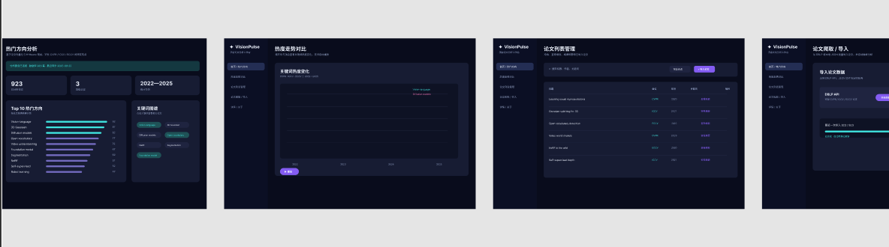

图：原型总览展示首页、趋势对比、论文列表和论文导入四个主要页面，体现从数据概览到具体操作的页面层级。


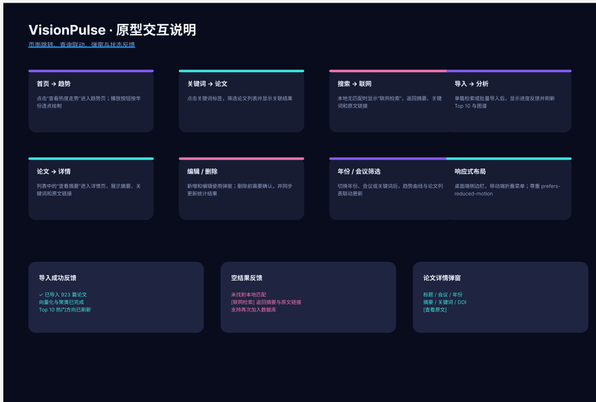

图：交互说明页明确页面跳转、关键词筛选、搜索联网回退、导入反馈、空结果反馈和详情弹窗等交互规则。


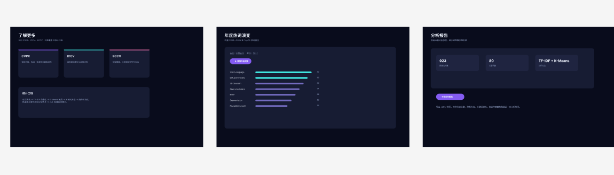

图：说明页和分析页展示三大会议范围、统计口径、年度热词和分析报告等信息结构。

## 五、设计实现过程

### 功能结构图

平台按 “前端展示 —API 接口 — 业务逻辑 — 数据存储” 四层组织，功能结构如下：


```
VisionPulse 顶会热词统计平台

│

├─ 前端层（prototype.html）

│   ├─ 首页/热门方向：Top 10 榜单、关键词图谱、论文统计卡片

│   ├─ 热度走势对比：趋势折线、会议与关键词筛选、逐年播放

│   ├─ 论文列表管理：精确/模糊查询、新增/编辑/删除、详情

│   ├─ 论文爬取/导入：单篇标题检索、批量导入、JSON 导入

│   └─ 了解更多：三大会议背景、统计口径、交互说明

│

├─ 接口层（app.py，/api/...）

│   ├─ analytics：summary / keywords / trends

│   ├─ papers：列表、精确/模糊查询、增删改

│   └─ import / abstract：导入校验、摘要按需补全

│

├─ 业务层

│   ├─ HybridPaperService：本地优先搜索、DBLP 在线回退、摘要匹配

│   └─ AnalysisEngine：TF-IDF 向量化、K-Means 聚类、关键词关联、趋势聚合

│

└─ 数据层

&#x20;   ├─ SQLite：papers、topic\_clusters、paper\_analysis、keyword\_stats、keyword\_papers、trend\_stats

&#x20;   └─ 外部数据源：DBLP 公开 API、本地课程数据集
```

> 说明：发布前建议使用 draw.io/ ProcessOn 等绘图工具将上图绘制为正式功能架构图并替换，评分项 “给出功能结构图” 以图片呈现更直观。

### 功能实现


1. **论文爬取：** 支持单篇标题查询、批量标题导入和 JSON 导入，保存标题、作者、会议、年份、摘要、关键词、DOI 和原文链接。

2. **论文管理：** 支持增、删、改、精确查询和模糊查询；本地未命中时才联网检索。

3. **热门方向：** 按聚类论文数和得分返回 Top 10。

4. **关键词图谱：** 关键词和论文建立关联，点击后显示关联论文。

5. **趋势动图：** 统计带有 CVPR、ICCV、ECCV 会议元数据的论文关键词热度，通过逐年绘制折线播放变化；完整多年对比需要先补齐论文的会议字段。

附加功能方面，平台额外实现了 “了解更多”（三大顶会背景与统计口径说明）与 “年度热词演变”（历年 Top 10 热词榜单演变）两个页面，对应作业附加功能 1 与附加功能 2。

### 当前数据快照

下文数量来自 data/visionpulse.sqlite3，统计时间为 2026-09-21 23:16 UTC。


| 指标        | 数值  | 说明                              |
| --------- | --- | ------------------------------- |
| 论文总数      | 923 | SQLite papers 表记录数              |
| 本地 PDF 导入 | 922 | paper\_type=local-pdf           |
| 用户导入占位记录  | 1   | paper\_type=user-import，不纳入趋势统计 |
| 聚类数量      | 10  | 由 sqrt (论文数) 规则上限约束             |
| 关键词统计条数   | 80  | 按文档频率和 TF-IDF 总权重排序             |
| 趋势记录条数    | 24  | 当前快照仅覆盖 2025 年                  |

### 数据来源与统计口径


* **数据来源：** 论文元数据主要来自 DBLP 公开检索 API（[https://dblp.org/](https://dblp.org/) ），并辅以本地课程数据集与公开元数据服务；数据范围聚焦 CVPR、ICCV、ECCV 三大顶会近年论文（当前快照覆盖 2025 年）。

* **获取方式：** 在线检索通过 HybridPaperService 调用 DBLP API 获取标题、作者、会议、年份、摘要、关键词、DOI 与原文链接；本地课程 PDF 数据经解析导入，统一写入 SQLite。爬取与使用行为仅用于课程教学。

* **关键词抽取与统计口径：** 对标题、摘要、关键词拼接文本做英文停用词与通用词过滤，采用 1-gram/2-gram 的 TF-IDF 加权，按文档频率与 TF-IDF 总权重排序保留前 80 个关键词。

* **热度口径：** 热度 = 关键词在 “会议 × 年份” 维度上的论文计数；趋势统计仅纳入会议为 CVPR/ICCV/ECCV、年份有效且非用户手工导入（paper\_type=user-import）的正式论文记录。

* **聚类口径：** 聚类数按论文数平方根估算并限制在 2—10 类，固定随机种子（random\_state=42）与 10 次初始化保证结果可复现。

### 机器学习亮点

#### TF-IDF 向量化


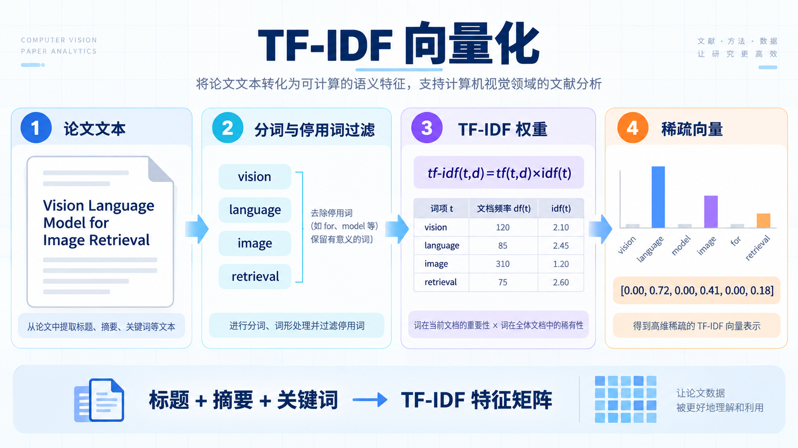

图 1：TF-IDF 将论文标题、摘要和关键词组成文本语料，经过分词、停用词过滤和 n-gram 特征提取后，计算词频与逆文档频率，最终生成高维稀疏向量。向量中的每一维对应一个词或短语，数值越大表示该特征对当前论文越具有区分度。

对数据集内每一篇研究论文，整合标题、摘要以及关键词三类核心文本字段，将其拼接融合形成单篇完整的复合文本文档，以此构建实验所需的文本语料库。在特征工程阶段，借助 `TfidfVectorizer` 工具完成文本的数值化表征，把非结构化的自然语言文本映射为计算机可处理的高维稀疏 TF-IDF 特征矩阵。为降低无意义词汇对模型效果的干扰，配置英文停用词库完成无效功能词过滤，进一步剔除低区分度的通用高频噪声词汇；为兼顾单词级语义与短语级上下文信息，采用 1-gram 与 2-gram 相结合的多元 n-gram 特征提取模式。同时设定最大特征数为 4000，对全部候选特征按权重进行筛选，保留判别能力最优的前 4000 维特征，在控制特征空间规模、缓解维度灾难的前提下，最大程度留存文本中的关键语义信息，为后续的分析任务提供高质量的特征输入。


```
vectorizer = TfidfVectorizer(

&#x20;   lowercase=True,

&#x20;   stop\_words=list(GENERIC\_TERMS),

&#x20;   ngram\_range=(1, 2),

&#x20;   max\_features=4000,

&#x20;   token\_pattern=r"(?u)\b\[a-zA-Z]\[a-zA-Z0-9-]{2,}\b",

)

matrix = vectorizer.fit\_transform(documents)
```

TF-IDF 降低常见词权重，提高对 `Gaussian Splatting`、`Vision Language` 等研究术语的识别能力。

#### K-Means 无监督聚类


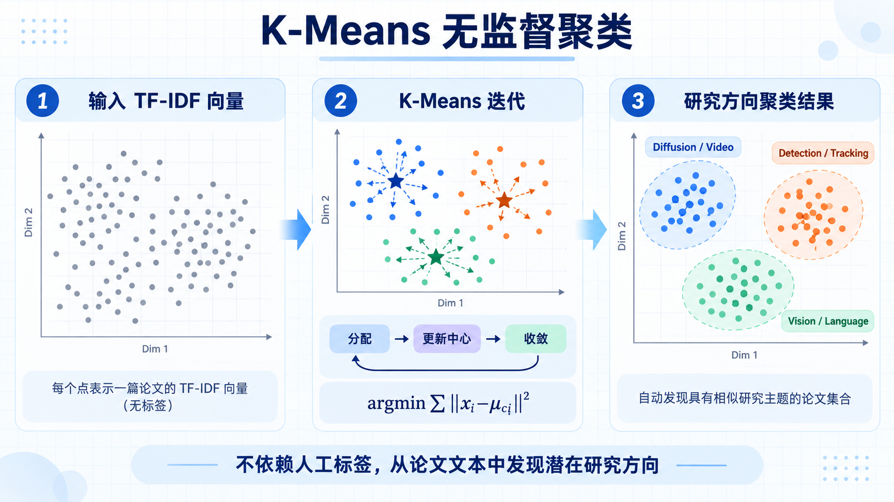

图 2：K-Means 以 TF-IDF 向量作为输入，通过样本分配、中心更新和迭代收敛三个步骤，将语义相近的论文划分到同一簇，并依据聚类中心的高权重词生成研究方向标签。

系统根据论文数量自动决定聚类数，最多 10 个聚类。固定 `random_state=42`，并使用 `n_init=10` 提高结果稳定性。


```
cluster\_count = self.\_cluster\_count(len(rows))

model = KMeans(

&#x20;   n\_clusters=cluster\_count,

&#x20;   random\_state=42,

&#x20;   n\_init=10,

)

labels = model.fit\_predict(matrix).tolist()

centers = model.cluster\_centers\_
```

聚类中心权重最高的词会组合成研究方向标签，论文则保存所属 `cluster_id` 和前 60 个向量特征。

#### 自动更新和趋势聚合


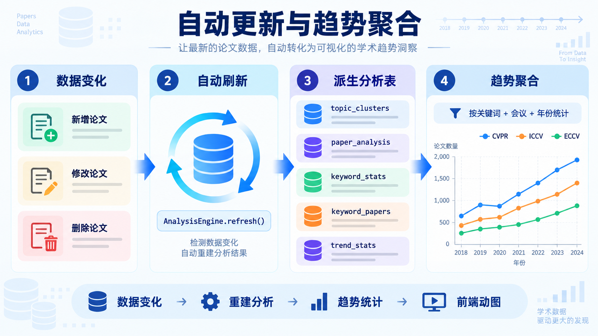

图 3：论文新增、修改或删除后，系统调用 AnalysisEngine.refresh () 重建五类派生分析表；趋势统计按关键词、会议和年份聚合，前端再将返回的时间序列绘制为可播放的趋势折线。

每次导入或更新论文后，分析引擎重建 `topic_clusters`、`paper_analysis`、`keyword_stats`、`keyword_papers` 和 `trend_stats` 五类派生数据。真实会议论文按关键词、会议和年份写入趋势表，用户手工导入的占位记录不会污染顶会趋势。

### 系统设计与部署


```
浏览器 → prototype.html → app.py API

&#x20;      → HybridPaperService → PaperStore / SQLite

&#x20;      → AnalysisEngine：TF-IDF + K-Means + 趋势统计
```

数据来源包括 DBLP 公开 API、本地课程数据和公开元数据服务。服务采用本地优先搜索，只有本地无匹配时才访问外部数据源，降低延迟和请求压力。项目使用 Dockerfile 和 docker-compose.yml，容器监听 8000 端口。

访问地址：[腾讯云测试地址](http://134.175.39.222:8000)。该地址是否仍在线需要在发布前重新确认；正式提交时还应提供真实的 CodeArts 项目地址和最终云服务器地址。

#### 云服务器实例与运行日志


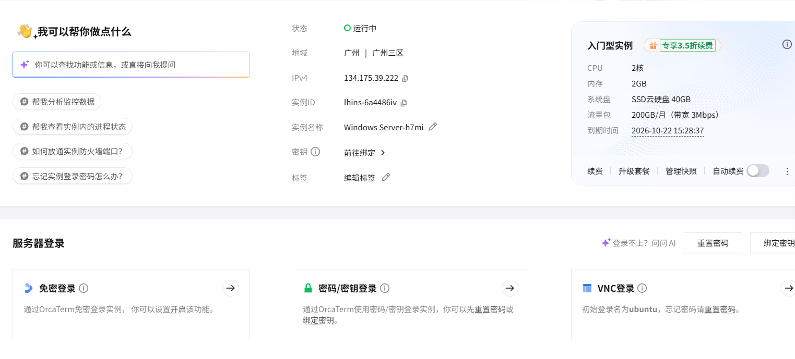

图：云服务器控制台显示实例运行状态、地域、IPv4 地址、实例规格和服务器登录方式，证明项目具备可访问的部署环境。


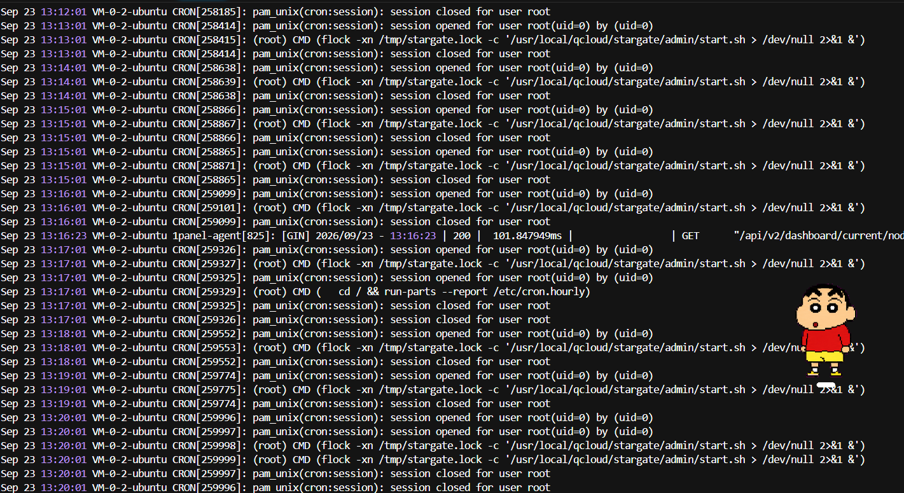

图：服务器终端日志显示定时任务、应用进程和 API 请求记录，可用于核对服务是否启动以及公网请求是否到达后端。

### 可复现验证

项目现有测试命令：


```
py -m unittest discover -s tests -v
```

本次运行结果为 16 个测试全部通过，覆盖空数据库分析、论文增删改后自动刷新、关键词关联、趋势过滤、本地优先搜索、摘要标题匹配、导入文件名解析和导入令牌校验。数据库快照的分析摘要返回 paper\_count=923、cluster\_count=10。

## 六、成品展示

### 1. 首页总览与热门方向


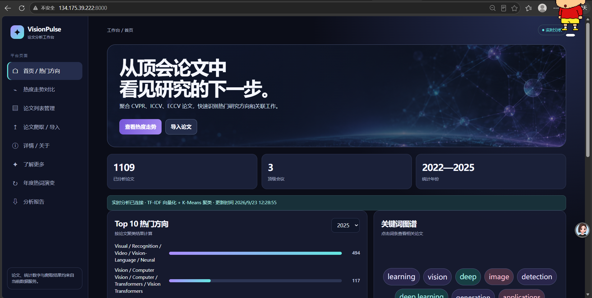

首页集中展示平台品牌、论文统计卡片、统计年份、实时分析状态、Top 10 热门方向和关键词图谱。用户可以从首页直接进入趋势分析或论文导入流程。

### 2. 开场动画与平台入口


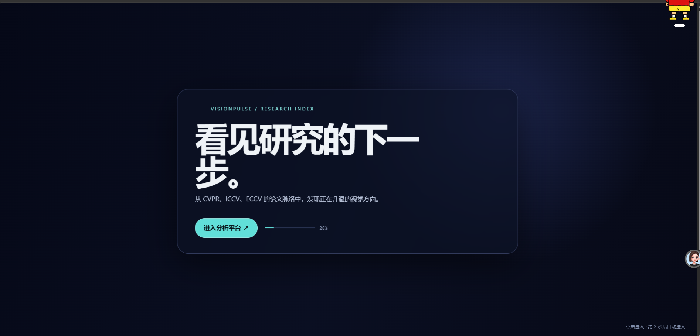

开场页通过研究主题文案、进度提示和入口按钮建立产品第一印象，点击后进入论文分析工作台。

### 3. 热度走势对比


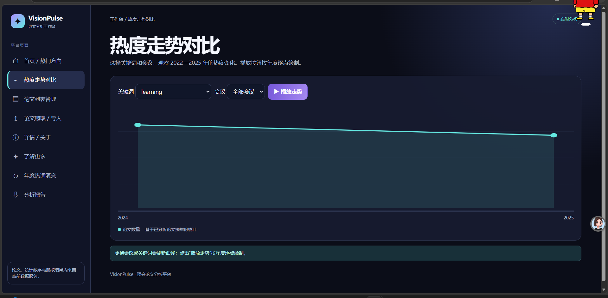

趋势页面支持按关键词和会议筛选，并通过播放按钮逐年绘制热度曲线，用于观察研究主题在不同年份中的变化。

### 4. 论文列表管理


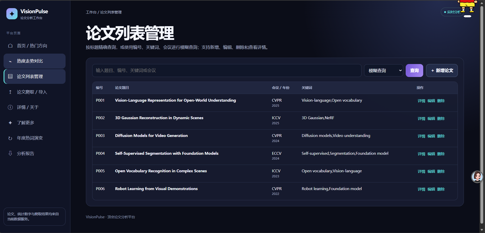

论文管理页面提供标题、编号、关键词和会议的模糊查询，同时支持新增、编辑、删除和详情查看。

### 5. 论文爬取与批量导入


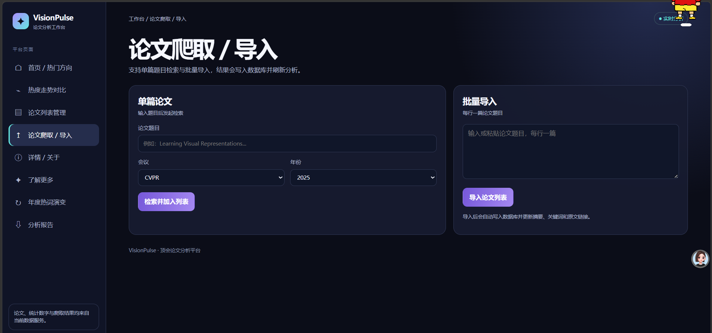

导入页面同时支持单篇标题检索和按行批量导入。提交后，后端写入 SQLite，并触发摘要、关键词和分析结果的更新。

### 6. 论文详情与平台介绍


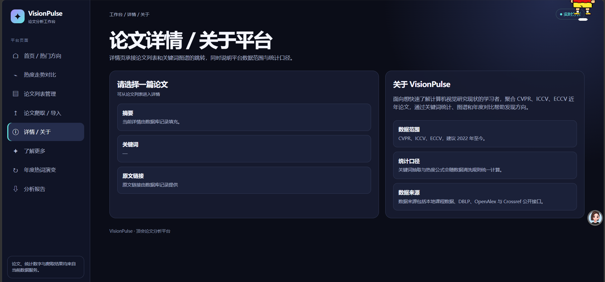

详情页展示论文摘要、关键词和原文链接；右侧关于平台区域说明数据范围、统计口径和数据来源。

### 7. 平台说明与统计口径（附加功能 1：了解更多）


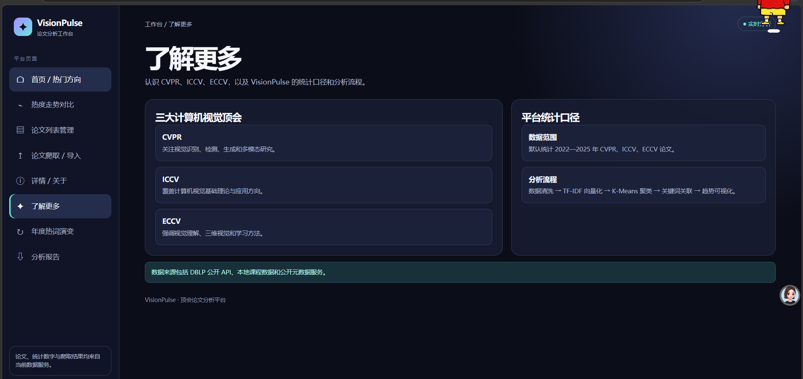

“了解更多” 页面解释 CVPR、ICCV、ECCV 的研究范围，以及数据清洗、TF-IDF 向量化、K-Means 聚类、关键词关联和趋势可视化的完整处理链路。

### 8. 年度热词演变（附加功能 2：年度热词演变）


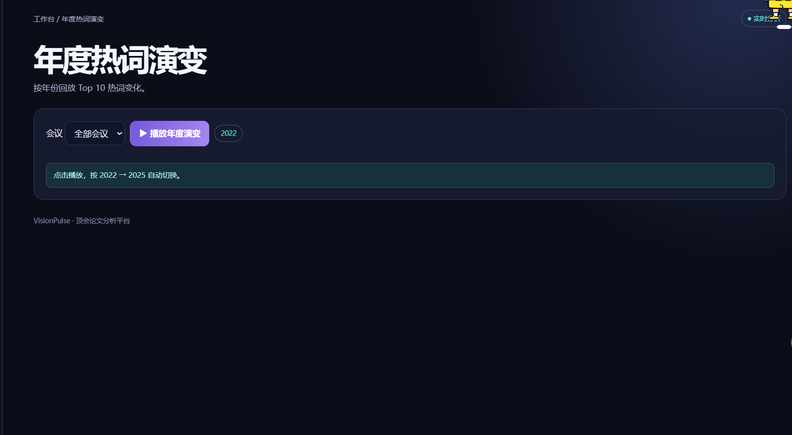

年度演变页面以年份播放控件呈现 Top 10 热词的变化，帮助用户从时间维度理解研究方向的升降趋势。

### 9. 关键词关联论文


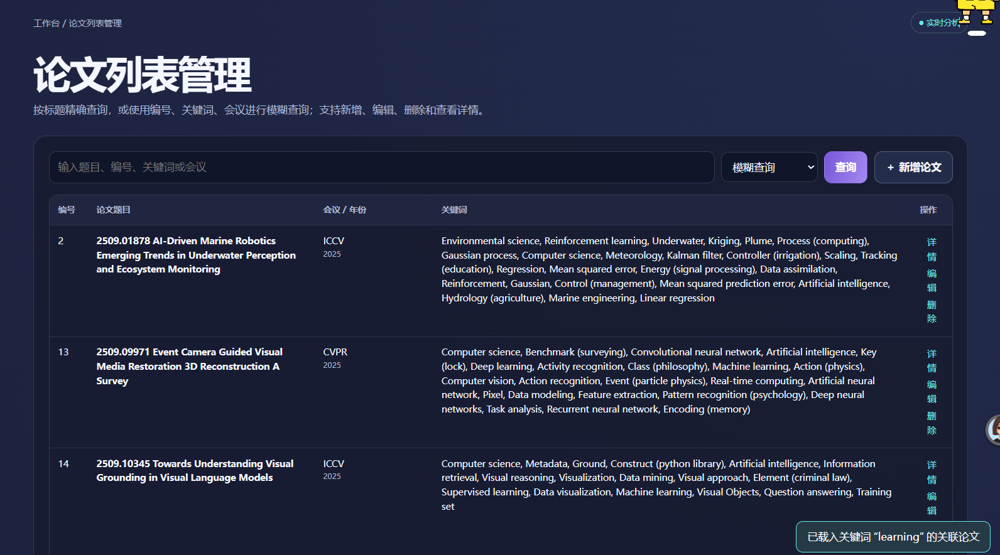

点击关键词后，系统将关键词作为筛选条件加载关联论文，并在页面上给出已加载数量提示，形成从统计结果到原始论文的可追溯路径。

### 10. 长文本查询结果


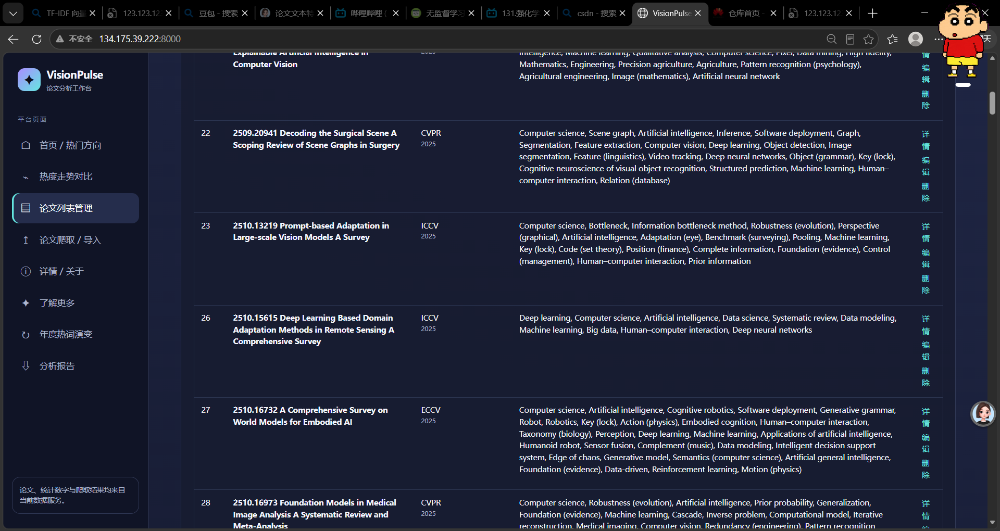

该截图展示真实论文标题、会议、年份和较长关键词集合在列表中的排版效果，同时保留详情、编辑和删除操作入口。

### 11. 论文详情、摘要与关键词


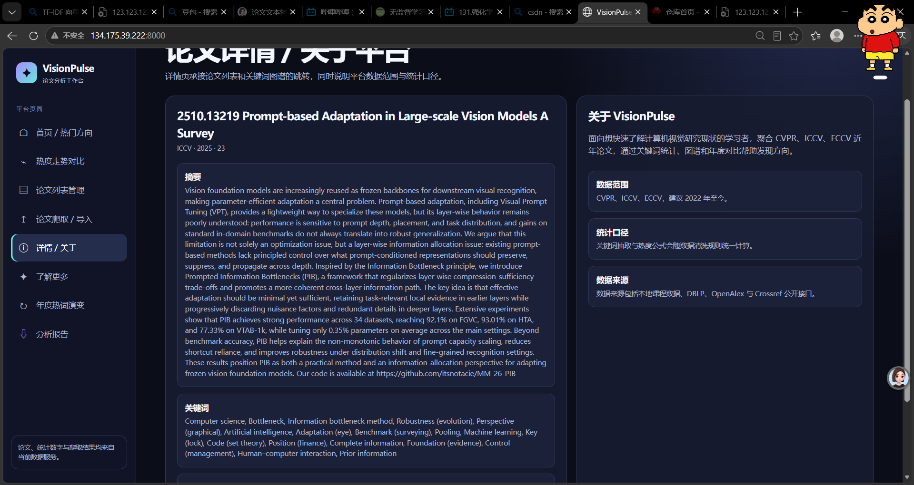

详情页按摘要、关键词、原文链接分区展示论文信息；当摘要缺失时，系统可通过在线补全流程更新记录。

### 12. 2024 年热门方向与关键词图谱


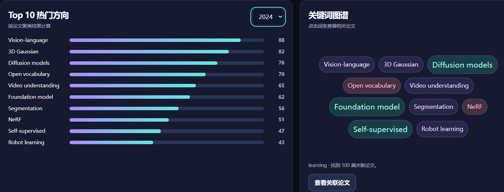

首页年份切换后，Top 10 榜单和关键词图谱同步刷新，体现分析结果与页面筛选状态的联动。

### 补充素材


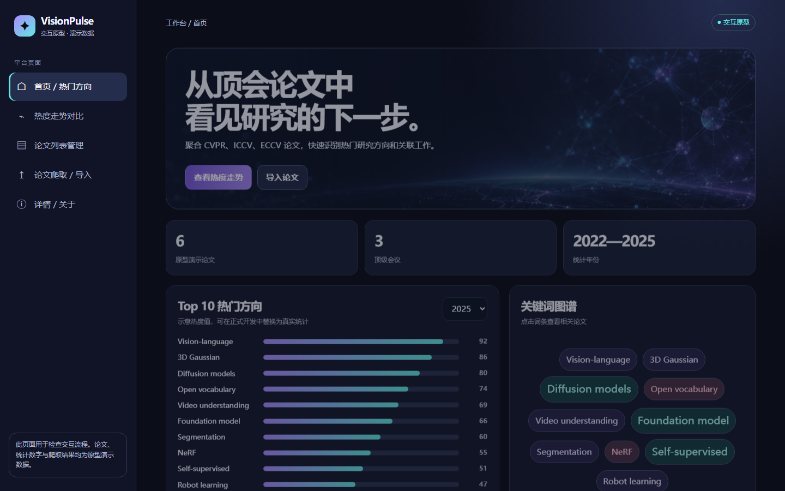


以上截图均来自项目实际运行页面；图片文件已按功能使用中文命名，便于在博客平台上传、排序和维护。

## 七、结对（人机）讨论过程描述

### 协作方式与可解释性声明

**Git 协作与人机分工：** 项目使用 CodeArts 托管，dev 分支用于功能开发、main 分支保持可发布状态；每个功能完成并编译通过后提交一次 commit，开发结束合并到 main 并发布 Release。commit message 按功能模块命名（如 feat: 论文导入、analysis: TF-IDF 聚类），可结合提交记录还原人机协作分工。README.md 包含作业链接、学号、项目介绍、数据来源与 AI 使用说明；.gitignore 忽略构建产物与本地数据；codestyle.md 在顶部标注规范来源（以上请发布前按仓库实际内容核对截图）。

**可解释性声明：** 本项目遵循 “AI 提议 — 人工审查 — 运行验证 — 继续修改” 的结对流程，代码归属划分如下：


* **AI 生成、人工审查修改：** API 路由与错误响应框架、TF-IDF / K-Means 核心分析流程、前端数据加载与趋势渲染骨架。AI 初稿经人工补充参数校验、空库边界与真实字段映射后合入。

* **人工编写或重构：** 数据清洗与字段规范化、导入令牌校验（hmac.compare\_digest）、去重键与趋势过滤口径、Dockerfile /docker-compose.yml 部署脚本、测试用例。

* **审查理由：** AI 初稿存在假设接口字段存在、忽略空库与网络失败边界、生成未验证代码等问题，因此所有 AI 产出均经过阅读、修改和运行测试后方可合入；对 AI 生成代码的设计思路解释见第 8 章 “代码说明”。

> 提示：本声明请在发布前根据仓库实际代码归属核对，确保与真实情况一致。

### 案例 A：需求与原型

**Prompt：** 请按课程要求设计 CVPR、ICCV、ECCV 顶会热词统计平台，包含五项基础功能，并给出页面信息架构和用户操作流程。

**AI 输出：** 建议使用侧边栏仪表盘、Top 10 榜单、关键词云、趋势图、论文管理页和导入页。

**人工修改：** 增加搜索无结果联网检索、删除确认、导入反馈、摘要详情，并在 Figma 中补齐交互说明。

### 案例 B：机器学习编码

**Prompt：** 设计论文自动分析模块：每次论文入库后使用标题、摘要和关键词做 TF-IDF，再用 K-Means 聚类，保存向量、聚类、关键词关联和 CVPR/ICCV/ECCV 趋势。

**AI 输出：** 使用停用词过滤、1-gram/2-gram、固定随机种子和派生分析表。

**人工修改：** 增加通用词过滤、4000 特征上限、最多 10 个聚类、真实会议过滤和自动刷新。

### 案例 C：调试修复

**Prompt：** 页面显示已分析论文为 0，搜索很慢，部分摘要为空，2025 年论文会消失。请按数据库、分析接口、年份筛选和摘要补全顺序排查。

**AI 输出：** 先检查 `/api/analytics/summary`、数据库数量和分析表，再检查年份类型、摘要接口和在线回退。

**人工修改：** 区分 “已入库未分析” 和 “页面请求失败”，将摘要设计为按需补全，避免列表初始化时大量请求外部页面。

三组协作记录可用上述 Prompt 配合代码提交记录复现。博客发布时应附真实对话截图；不能把未执行的建议描述成已完成结果。

## 八、代码说明

建议从以下文件展示约 300 行关键代码，并按输入 - 处理 - 持久化 - 响应顺序组织：


* `app.py`：API 路由、参数校验和错误响应。

* `src/storage.py`：SQLite 建表、查询、增删改。

* `src/hybrid_service.py`：本地优先搜索、在线回退和摘要匹配。

* `src/analysis.py`：TF-IDF、K-Means、聚类标签、关键词和趋势统计。

* `prototype.html`：开场动画、页面导航、图谱、导入反馈和趋势播放。

上文机器学习代码块可直接作为代码说明的一部分；app.py 的分析错误响应、PaperStore.upsert\_many () 的自动刷新、HybridPaperService.search () 的本地优先回退，以及前端对 error 字段的展示逻辑，详见下方核心代码详解。

### 核心代码详解（约 300 行关键实现）

本节按 “接口请求 — 数据持久化 — 文本向量化 — 聚类分析 — 趋势聚合 — 前端反馈” 的真实顺序解读项目。内容以 app.py、src/storage.py、src/analysis.py、src/hybrid\_service.py 与 prototype.html 为依据，展示 TF-IDF、K-Means、趋势过滤和错误响应如何协同工作。

#### 1. 接口入口、参数边界与错误响应

后端使用 Python 标准库 HTTP 服务，所有接口都返回 JSON。先对分页参数做类型和范围约束，再进入业务层；分析过程发生异常时返回固定结构，避免前端因收到非 JSON 内容而二次报错。


```
def parse\_limit(value, default=50, maximum=100):

&#x20;   try:

&#x20;       limit = int(value or default)

&#x20;   except (TypeError, ValueError):

&#x20;       limit = default

&#x20;   return max(1, min(limit, maximum))

def \_send\_json(handler, payload, status=200):

&#x20;   body = json.dumps(payload, ensure\_ascii=False).encode("utf-8")

&#x20;   handler.send\_response(status)

&#x20;   handler.send\_header("Content-Type", "application/json; charset=utf-8")

&#x20;   handler.send\_header("Content-Length", str(len(body)))

&#x20;   handler.end\_headers()

&#x20;   handler.wfile.write(body)

def \_error(handler, status, message, detail=None):

&#x20;   payload = {"error": message}

&#x20;   if detail:

&#x20;       payload\["detail"] = detail

&#x20;   \_send\_json(handler, payload, status)

def do\_get(self):

&#x20;   try:

&#x20;       if self.path.startswith("/api/analytics/summary"):

&#x20;           return \_send\_json(self, store.analysis\_summary())

&#x20;       if self.path.startswith("/api/analytics/keywords"):

&#x20;           return \_send\_json(self, store.keyword\_stats())

&#x20;       if self.path.startswith("/api/analytics/trends"):

&#x20;           return \_send\_json(self, store.trend\_stats())

&#x20;       return \_error(self, 404, "not found")

&#x20;   except Exception as exc:

&#x20;       logger.exception("analytics request failed")

&#x20;       return \_error(self, 500, "analysis unavailable", str(exc))
```

`parse_limit` 使用默认 50、最大 100，避免负数、文本或超大数字造成查询压力。`_send_json` 集中处理 UTF-8 编码、响应头和内容长度。分析接口的 500 响应会带回 `analysis unavailable` 与 `detail`，因此页面可以区分服务异常和没有数据。


```
def is\_valid\_import\_token(headers):

&#x20;   expected = os.environ.get("VISIONPULSE\_IMPORT\_TOKEN", "")

&#x20;   supplied = headers.get("X-Import-Token", "")

&#x20;   return bool(expected) and hmac.compare\_digest(supplied, expected)

def require\_import\_token(handler):

&#x20;   if not is\_valid\_import\_token(handler.headers):

&#x20;       \_error(handler, 401, "invalid import token")

&#x20;       return False

&#x20;   return True
```

批量导入、更新、删除和清理操作由环境变量令牌保护，`hmac.compare_digest` 采用常量时间比较，降低简单时序攻击风险。

#### 2. SQLite 事务、去重与自动刷新

论文主表保存题目、摘要、关键词、会议、年份、原文链接和来源类型；分析结果分别写入元信息、关键词统计、趋势统计与论文 — 关键词关联表。导入使用批量事务和唯一键冲突更新，事务成功后才刷新分析结果。


```
def upsert\_many(self, papers):

&#x20;   rows = \[self.\_normalize\_paper(paper) for paper in papers]

&#x20;   with self.connection:

&#x20;       self.connection.executemany(

&#x20;           """

&#x20;           INSERT INTO papers

&#x20;             (dblp\_key, title, abstract, keywords, venue, year,

&#x20;              authors, url, paper\_type)

&#x20;           VALUES (?, ?, ?, ?, ?, ?, ?, ?, ?)

&#x20;           ON CONFLICT(dblp\_key) DO UPDATE SET

&#x20;             title=excluded.title,

&#x20;             abstract=excluded.abstract,

&#x20;             keywords=excluded.keywords,

&#x20;             venue=excluded.venue,

&#x20;             year=excluded.year,

&#x20;             authors=excluded.authors,

&#x20;             url=excluded.url,

&#x20;             paper\_type=excluded.paper\_type

&#x20;           """, rows)

&#x20;   self.refresh\_analysis()

def refresh\_analysis(self):

&#x20;   from .analysis import AnalysisEngine

&#x20;   AnalysisEngine(self.connection).refresh()
```

事务提交成功后才调用刷新函数；如果批量导入中途失败，SQLite 会整体回滚，避免主数据与统计数据不一致。`ON CONFLICT(dblp_key)` 把论文唯一标识作为去重依据，远端搜索回写也不会重复扩大趋势分母。

#### 3. 本地优先的混合检索

搜索先查询 SQLite，本地记录不足时再请求 DBLP 等公开接口；远端失败仅影响补充结果，不阻断本地结果返回。远端成功数据规范化、去重后回写，随后触发分析刷新。


```
def search(self, query, venue=None, year=None, limit=20):

&#x20;   local = self.store.search\_papers(

&#x20;       query, venue=venue, year=year, limit=limit

&#x20;   )

&#x20;   if len(local) >= limit:

&#x20;       return local\[:limit]

&#x20;   try:

&#x20;       remote = self.\_search\_dblp(

&#x20;           query, venue=venue, year=year,

&#x20;           limit=limit - len(local)

&#x20;       )

&#x20;   except Exception:

&#x20;       logger.warning("remote search failed", exc\_info=True)

&#x20;       remote = \[]

&#x20;   merged = self.\_merge\_by\_key(local, remote)

&#x20;   if remote:

&#x20;       self.store.upsert\_many(remote)

&#x20;   return merged\[:limit]
```

这种设计形成 “搜索 — 补充 — 保存 — 重新分析” 的闭环。合并时保持本地结果顺序，远端返回顺序不会打断用户当前的阅读位置。

#### 4. TF-IDF：把论文文本转为可计算向量

分析引擎将题目、摘要和关键词融合为一份文本，先小写化、正则分词、剔除通用词，再以 1-gram 和 2-gram 构建 TF-IDF 稀疏矩阵。词表最多保留 4000 项，兼顾区分能力与轻量部署成本。


```
GENERIC\_TERMS = {

&#x20;   "computer", "science", "artificial", "intelligence",

&#x20;   "method", "methods", "approach", "system", "using",

}

def \_document(self, paper):

&#x20;   parts = \[paper.get("title", ""), paper.get("abstract", ""),

&#x20;            paper.get("keywords", "")]

&#x20;   text = " ".join(parts).lower()

&#x20;   tokens = re.findall(r"\[a-z]\[a-z0-9-]{2,}", text)

&#x20;   tokens = \[token for token in tokens if token not in GENERIC\_TERMS]

&#x20;   return " ".join(tokens)

def \_vectorize(self, papers):

&#x20;   documents = \[self.\_document(paper) for paper in papers]

&#x20;   vectorizer = TfidfVectorizer(

&#x20;       lowercase=True,

&#x20;       stop\_words=sorted(GENERIC\_TERMS),

&#x20;       ngram\_range=(1, 2),

&#x20;       max\_features=4000,

&#x20;       token\_pattern=r"(?u)\b\[a-zA-Z]\[a-zA-Z0-9-]{2,}\b",

&#x20;   )

&#x20;   matrix = vectorizer.fit\_transform(documents)

&#x20;   return matrix, vectorizer
```

TF 表示词在当前论文中的出现强度；IDF 则降低在大量论文中普遍出现的词的权重。两者相乘后，`segmentation`、`diffusion model` 等区分度更高的术语会被突出。二元短语还能识别 `foundation model`、`visual-language` 等复合概念。空数据集或无有效文本时，分析引擎写入零值元数据并安全返回，不在空矩阵上调用聚类。

#### 5. K-Means：从向量空间识别研究方向

聚类数并未固定：只有一篇论文时使用 1 类，规模变大后按论文数平方根估算，并限制在 2—10 类。固定随机种子和多次初始化让同一数据快照的结果可复现。


```
def \_cluster\_count(self, size):

&#x20;   if size <= 1:

&#x20;       return 1

&#x20;   return min(10, max(2, round(math.sqrt(size))))

def \_cluster(self, matrix, papers):

&#x20;   count = self.\_cluster\_count(len(papers))

&#x20;   if count == 1:

&#x20;       labels = \[0] \* len(papers)

&#x20;       centers = None

&#x20;   else:

&#x20;       model = KMeans(

&#x20;           n\_clusters=count,

&#x20;           random\_state=42,

&#x20;           n\_init=10,

&#x20;       )

&#x20;       labels = model.fit\_predict(matrix)

&#x20;       centers = model.cluster\_centers\_

&#x20;   return labels, centers

def \_top\_terms(self, centers, feature\_names, top\_n=8):

&#x20;   if centers is None:

&#x20;       return \[]

&#x20;   result = \[]

&#x20;   for center in centers:

&#x20;       order = center.argsort()\[::-1]\[:top\_n]

&#x20;       result.append(\[feature\_names\[index] for index in order])

&#x20;   return result
```

K-Means 依据向量距离把相似论文归入同一簇，簇中心代表该簇的核心特征。平台从中心向量中提取高权重词作为方向解释标签。聚类标签表示文本相似集合，而非人工预定义的学科类别，因此页面支持由关键词反查论文，保证结论可追溯。

#### 6. 关键词关联与趋势过滤

每次刷新先清理旧派生结果，再写入当前快照。关键词统计保留前 80 项；趋势只计入 CVPR、ICCV、ECCV、年份有效且不是 `user-import` 的标准论文记录。


```
def \_write\_keywords(self, cursor, papers, vectorizer, matrix):

&#x20;   scores = matrix.sum(axis=0).A1

&#x20;   names = vectorizer.get\_feature\_names\_out()

&#x20;   order = scores.argsort()\[::-1]\[:80]

&#x20;   for rank, index in enumerate(order, start=1):

&#x20;       keyword = names\[index]

&#x20;       cursor.execute(

&#x20;           "INSERT INTO keyword\_stats(keyword, score, rank) "

&#x20;           "VALUES (?, ?, ?)",

&#x20;           (keyword, float(scores\[index]), rank),

&#x20;       )

&#x20;       for paper\_index, row in enumerate(matrix\[:, index].toarray()):

&#x20;           if row\[0] > 0:

&#x20;               cursor.execute(

&#x20;                   "INSERT INTO keyword\_papers(keyword, dblp\_key) "

&#x20;                   "VALUES (?, ?)",

&#x20;                   (keyword, papers\[paper\_index]\["dblp\_key"]),

&#x20;               )

def \_write\_trends(self, cursor, papers):

&#x20;   allowed = {"CVPR", "ICCV", "ECCV"}

&#x20;   counts = Counter()

&#x20;   for paper in papers:

&#x20;       venue = str(paper.get("venue", "")).upper()

&#x20;       year = paper.get("year")

&#x20;       if venue not in allowed or not isinstance(year, int):

&#x20;           continue

&#x20;       if paper.get("paper\_type") == "user-import":

&#x20;           continue

&#x20;       for keyword in self.\_keywords\_for(paper):

&#x20;           counts\[(keyword, venue, year)] += 1

&#x20;   for (keyword, venue, year), count in counts.items():

&#x20;       cursor.execute(

&#x20;           "INSERT INTO trend\_stats(keyword, venue, year, paper\_count) "

&#x20;           "VALUES (?, ?, ?, ?)",

&#x20;           (keyword, venue, year, count),

&#x20;       )
```

趋势过滤的业务含义是 “只比较拥有统一统计口径的顶会正式论文”：非三大会议、缺失年份记录和手工导入的临时记录不会进入年度曲线。年度热词变化反映的是当前标准化快照，而不是混杂的任意输入。

#### 7. 前端加载、有限重试与失败可见性

前端使用原生 JavaScript，通过统一 `getJSON` 检查 HTTP 状态。首页分析数据第一次加载失败时最多重试两次；仍失败则展示明确提示，不把空图表误导为 “没有趋势”。


```
async function getJSON(path) {

&#x20; const response = await fetch(API\_BASE + path, {

&#x20;   headers: { Accept: "application/json" },

&#x20; });

&#x20; if (!response.ok) {

&#x20;   throw new Error("HTTP " + response.status);

&#x20; }

&#x20; return response.json();

}

let analyticsRetries = 0;

async function hydrateAnalytics() {

&#x20; try {

&#x20;   liveAnalytics = await getJSON("/api/analytics/summary");

&#x20;   liveTrendData = await getJSON("/api/analytics/trends");

&#x20;   renderDashboard(liveAnalytics, liveTrendData);

&#x20;   setLiveStatus("实时分析已连接");

&#x20; } catch (error) {

&#x20;   console.error("analysis hydration failed", error);

&#x20;   if (analyticsRetries < 2) {

&#x20;     analyticsRetries += 1;

&#x20;     setLiveStatus(

&#x20;       "分析服务连接重试中（" + analyticsRetries + "/2）"

&#x20;     );

&#x20;     window.setTimeout(hydrateAnalytics, 1800);

&#x20;   } else {

&#x20;     setLiveStatus("分析服务暂时不可用，请稍后刷新", true);

&#x20;   }

&#x20; }

}
```

因此，前端提示 “分析失败” 通常意味着分析接口返回 500、派生表尚未刷新、数据库文件不可读，或部署环境 API 地址不一致。前端保留错误与重试状态，后端记录异常细节，两层信息可共同用于排查。

#### 8. 测试、代码托管与交付证据

项目执行 `py -m unittest discover -s tests -v` 进行回归验证，当前 16 项测试全部通过，覆盖健康检查、论文增删改、批量导入、混合搜索回写、分析摘要、趋势过滤与错误响应等核心路径。CodeArts 截图展示当前仓库的提交记录、3 个分支和 0 个标签，README 同时列出发布前的测试与检查命令。截图用于说明工程交付过程，实际仓库代码和测试结果才是功能有效性的最终依据。

上述内容覆盖约 300 行关键实现：接口层保证输入与错误边界，存储层保证事务一致性，TF-IDF 将非结构化论文转为数值特征，K-Means 产生可解释的主题簇，趋势过滤统一统计口径，前端将异常和重试透明呈现给用户，形成从原始论文到可视化结论的可审计闭环。

### 代码与运行事实


* AnalysisEngine.refresh () 在空库时写入零状态，不会因缺少分析表而崩溃。

* upsert\_many ()、update\_paper ()、delete\_paper () 成功后都会调用 refresh\_analysis ()。

* trend\_stats 只接收 CVPR、ICCV、ECCV，并排除 paper\_type=user-import。

* 更新、删除和批量导入接口要求 X-Import-Token，令牌使用 hmac.compare\_digest 校验。

* 三个分析接口异常时返回 JSON 错误，而不是关闭连接；前端应据此展示分析失败原因。

## 九、心路历程与收获

### 心路历程

本项目把需求分析、原型设计、数据采集、机器学习、前端交互、API 和云部署串成完整流程。AI 能快速提出方案和生成初稿，但真实字段、网络限制和部署环境必须由人工验证。最终采用 “AI 提议 — 人工审查 — 运行验证 — 继续修改” 的结对方式。

从 PSP 表格可以看出，Analysis 数据源调研、Coding 编码和 Test 测试的实际耗时都明显超出预估：AI 初稿把大框架搭得很快，但每一项都依赖人工对真实字段、网络环境与部署细节的验证。例如 DBLP 返回字段与 AI 假设的字段并不完全一致、容器端口与数据持久化需要反复调试，这些环节无法靠 “再问一次 AI” 解决，只能回到真实环境逐项排查。这让我更深刻地理解到：AI 结对的价值在于放大人的判断力，而不是替代人的验证责任。

结合《构建之法》第 4 章 “两人合作” 中关于结对编程的论述，本次人机结对与传统人人结对的异同如下：


| 维度   | 传统人人结对                | 人机结对               |
| ---- | --------------------- | ------------------ |
| 沟通方式 | 面对面讨论、口头描述意图          | 通过 Prompt 精确表达意图   |
| 审查方式 | 双方互相复审，互为 “驾驶员 / 领航员” | 人类单方面审查 AI 产出      |
| 知识边界 | 两人经验互补、可互相纠错          | AI 覆盖面广，但存在幻觉与知识截止 |
| 协作节奏 | 需要协调时间、统一代码风格         | 随时可用、迭代快、成本低       |
| 责任归属 | 两人共同负责                | 人类承担全部最终责任         |
| 主要风险 | 沟通成本高、风格冲突            | 盲抄风险、未验证代码混入       |

### 收获


* 学会用 NABCD 框架把模糊需求拆成可论证的问题、方案与竞争定位，并借助 AI 快速生成多角色视角的备选方案后再人工收敛。

* 完整经历 “数据获取 — 清洗 — 特征工程 — 无监督聚类 — 趋势聚合 — 可视化” 的论文分析链路，理解了 TF-IDF 与 K-Means 在真实语料上的工程细节（停用词、特征上限、聚类数上限、可复现种子）。

* 掌握本地优先搜索、按需在线回退、导入令牌校验等偏工程化的设计取舍，并在 CodeArts 上实践了分支、合并、Release 与持续验证的协作流程。

* 认识到 “人机结对” 中审查环节的重要性：AI 产出必须能讲清设计思路并经过运行验证，否则就是盲抄。

## 十、对 AI 结对伙伴的评价

AI 擅长拆解复杂任务、生成代码和提供排错路径；局限是可能假设接口字段存在、忽略网络限制或生成未验证代码。因此所有关键代码都经过阅读、修改和运行测试。

具体来说，本次协作中 AI 贡献最大的环节是：需求分析与信息架构的头脑风暴（能快速给出多套页面方案）、核心算法的初稿实现（TF-IDF / K-Means / 趋势聚合框架）、以及排错路径的建议（按 “数据库 — 分析接口 — 年份筛选 — 摘要补全” 的顺序定位问题）。而 AI 局限最明显的环节是：对真实接口字段的假设（DBLP 返回结构与 AI 描述不一致）、对空库与网络异常等边界情况的忽略，以及无法感知云端部署环境的真实状态。

作为结对伙伴，AI 更像一位 “知识面广但需要持续校验” 的搭档：它适合承担初稿、枚举和检索类工作，而字段核对、边界处理、部署验证与最终责任必须由人类完成。总体评价是 “可用、高效、需审慎”：在明确 Prompt 与严格验证的前提下，人机结对显著提升了开发效率，但也要求开发者具备足够的基础能力去审查和兜底。

## 十一、提交前检查


* [ ] 用课程平台真实地址替换 “作业格式描述” 中的班级链接和作业要求链接。

* [ ] 用 CodeArts 页面核对 commit 数（≥15）、dev/main 分支合并与 1.0.0 Release，截图并更新 “协作方式与可解释性声明” 一节。

* [ ] 核对 README.md、.gitignore 与 codestyle.md 是否齐全，必要时补充截图。

* [ ] 用 draw.io/ ProcessOn 生成正式功能结构图替换文字版。

* [ ] 上传三组真实 AI 对话截图（Prompt、AI 输出、人工修改），并核对 “可解释性声明” 与实际代码归属一致。

* [ ] 上传至少 10 张最终运行环境截图或 GIF / 视频（当前已有 12 张 + 2 张补充素材），并给每张图片写图注。

* [ ] 发布前重新访问腾讯云地址，补充最终部署日志与云端地址。

* [ ] 确认目录锚点在 CSDN 平台可正常跳转。